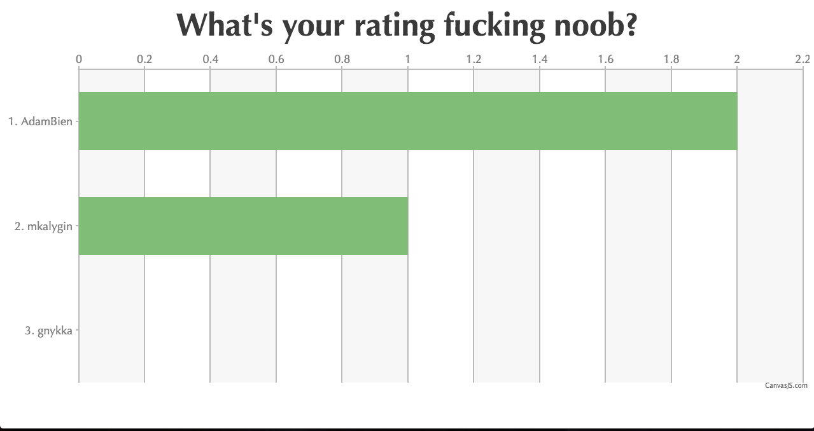

# WYRFN - What's Your Rating Fucking Noob?



## Overview

**DISCLAIMER: The author doesn't think that number of commits is a good metric to measure programmer's productivity. It is used only for reference and motivation.**

This is a static page with dynamic rating of GitHub contributors.
Some of [the most active GitHub users](https://gist.github.com/paulmillr/2657075/)
are chosen + author of this repo. Their activity on particular repos is measured
for the last three weeks and visualized as a barchart.

[This tool](http://zmoazeni.github.io/gitspective) helps to find the most recent activity of users.

The page is designed to motivate its author to work more on
pet projects and be as productive as one of the best programmers in the world.
After all, what's your rating fucking noob? Go and get shit done!

## Usage

- Put `.token` file into the root of the repo or define GITHUB_AUTH_TOKEN
environment variable.
- Edit `data.json` in order to setup contributors and repos to measure.
- Run `npm start` and open `http://localhost:1337` in your browser.

## Development

```
npm install
npm start
```
